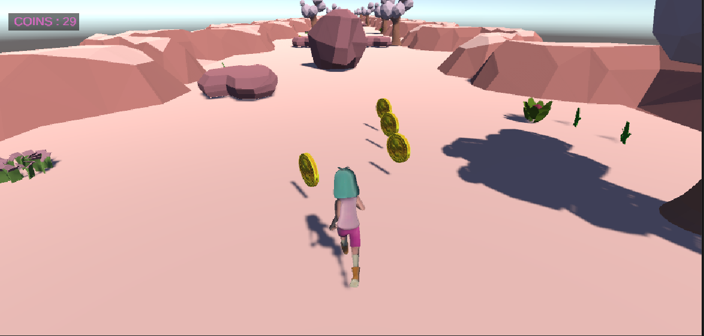
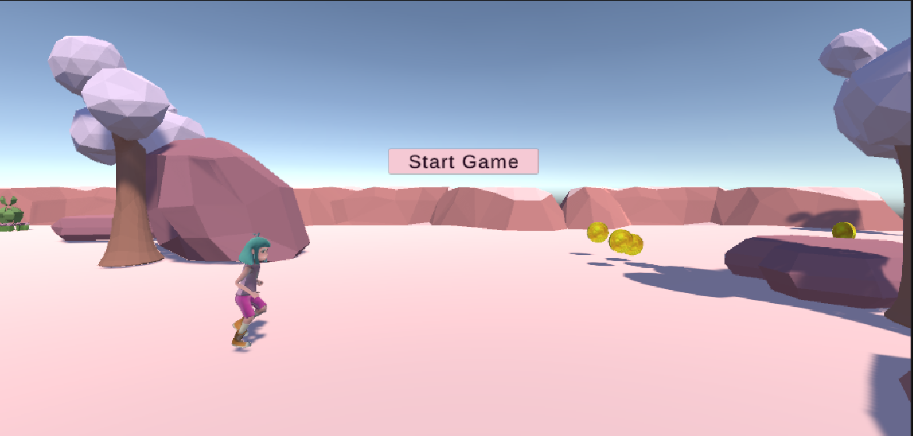

# 3D Endless Runner Game (Unity)

A 3D endless runner game built in Unity using C#. This project follows a structured game development process, featuring core game mechanics like continuous movement, obstacles, coin collection, and dynamic level generation — all designed with Unity’s built-in tools and custom C# scripts.

---

## Gameplay Overview

The player runs forward endlessly and can move left or right to avoid obstacles and collect coins. The environment is generated dynamically to maintain replayability and challenge.

---

## Game Mechanics

- **Automatic forward movement** of the player character.
- **Left/Right movement** using `A`/`D` or arrow keys.
- **Obstacle collision** triggers camera shake, animation, sound, and game restart.
- **Coin collection** increments the score with visual and sound feedback.
- **Infinite terrain generation** using randomly chosen track segments.
- **Main Menu Scene** with fade transitions and button navigation.

---

## Technical Implementations

### Architecture
- Modular C# scripts controlling specific components: movement, segment generation, collisions, and UI.
- Environment and gameplay assets grouped into reusable GameObjects and prefabs.

###  Player Controls
- Horizontal movement constrained within defined boundaries.
- Movement handled using `Transform.Translate()` for fluid motion.

### Physics & Collisions
- Unity Collider and Rigidbody system for detecting interactions.
- Coroutines for sequencing animations, sound, and scene reloads.

### UI Elements
- Main Menu UI built with Unity Canvas.
- In-game coin counter using TextMeshPro.
- Background music and SFX controlled via AudioSource components.
- Fade-out effect for smooth transitions between scenes.

---

## Code Implementations

- `PlayerMovement.cs`: Handles auto-forward and side movement.
- `CollisionDetect.cs`: Detects obstacle collision, plays animation and audio, restarts the game.
- `CollectCoin.cs`: Plays coin FX and updates coin counter.
- `SegmentGenerator.cs`: Generates random track segments every few seconds.
- `MasterInfo.cs`: Manages static coin count display.
- `MainMenuControl.cs`: Loads game scene with fade effect.
- `CollectableRotate.cs`: Adds rotation to coins for visual appeal.

---

## Project Structure

```bash
Assets/
├── Scripts/             # C# scripts (movement, collisions, generation, etc.)
├── Prefabs/             # Track segments, obstacles, and collectables
├── Scenes/              # Main Menu and Game Scene
├── Animations/          # Player and camera animations
├── Audio/               # BGM and sound effects
├── UI/                  # Canvas, coin counter, fade effects
└── Models/              # Imported 3D models (player, environment)

```
---

## Gameplay Screenshots

Here are a couple of screenshots showcasing the gameplay:

  
*Player running in the game environment.*

  
*Start screen before gameplay begins.*

---

## Gameplay Video

Watch the gameplay video here: [Google Drive Link to Gameplay Video](<https://drive.google.com/file/d/1kaVpm5ZS1VY21_xU2kblbf5r2LqQN4eP/view>)

